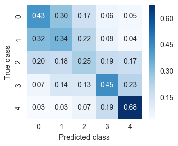

# Classification of Diabetic Retinopathy with Deep Features
Exploration of whether deep features/transfer learning can be used to classify different levels of diabetic retionpathy.

> **Diabetic Retinopathy** is the leading cause of blindness for people aged between 20 and 64 and is estimated to affect more than 93 million people. Detecting diabetic retinopathy requires trained clinicians to evaluate photographs of the retina. Automated approaches will hopefully speed up diagnosis and improve patient care.

Note: this readme is a summary of what I did. For full details of the method, please see the Jupyter notebook [`Model.ipynb`](Model.ipynb) in this repository.

## Deep features

I've only recently encountered the use of deep features/transfer learning to classify images. I thought it would be interesting to see if this technique could help identify and classify diabetic retinopathy. 

[TensorFlow](https://www.tensorflow.org) provides an implementation of the [Inception-v3](http://arxiv.org/abs/1512.00567) image recognition model. This deep convolutional neural network model was trained for the ImageNet Large Scale Visual Recognition Challenge. The model is trained on $10^6$ images across 1000 classes. The model does better than humans at classifying images into one of the 1000 classes. (See [blog post by Andrej Karpathy](http://karpathy.github.io/2014/09/02/what-i-learned-from-competing-against-a-convnet-on-imagenet/).) 

The layer before the final layer in the Inception-v3 network is a representation of the image being classified in a 2048-dimensional feature space. We can use the neural network to extract these feature vectors for new images even if the network hasn't seen them before. The feature vectors, or _deep features_ can then be used to classify the images. This is the basis of _transfer learning_ and is much faster than training a deep convolutional neural network from scratch.

## Image data

Fortunately, [Kaggle](https://www.kaggle.com) ran a competition to identify diabetic retinopathy. The competition closed in 2015, but the data are still available. The training data are 35126 retina photographs (in pairs, one for each eye) labelled by clinicians as in one of five classes of diabetic retinopathy (DR) from 0 (no DR) to 4 (proliferative DR).

<table> 
  <tr> 
    <td></td> 
    <td></td> 
  </tr> 
  <tr> 
    <td>
Image showing <b>no</b> diabetic retionpathy.
</td> 
    <td>
Image showing <b>proliferative</b> diabetic retionpathy.
</td> 
  </tr> 
</table>

## Extracting deep features

I was inspired by the TensorFlow tutorial [How to Retrain Inception's Final Layer for New Categories](https://www.tensorflow.org/how_tos/image_retraining/) and associated code from their GitHub repo (https://github.com/tensorflow/tensorflow/tree/master/tensorflow/examples/image_retraining).

The Python script [`feature_extraction.py`](feature_extraction.py) extracts the 2048-dimensional feature vector for each image and stores it in a binary file in NumPy format. This took about 10 hours to process all 35126 images on my laptop.

## Visualising features

I find [t-SNE](https://lvdmaaten.github.io/tsne/) dimensionality reduction is an excellent way to visualise high-dimensional data. In my experience, if a 2D scatter plot of features reduced with t-SNE shows a good separation of the classes, then a classifier is likely to perform well. 

There are some clearly defined groups in the plot but unfortunately not great separation between the levels of diabetic retinopathy. (On further investigation the defined groups correspond to different croppings of the original images and whether the image is inverted.) 

Unfortunately, the plot suggests to me that classifcation models will struggle to perform well. Nevertheless, I wanted to see how well they could be classified.

## Classification model

I used a simple logistic regression model to explore how well the classes could be separated.

The number of training images in each of the five classes was highly unbalanced with 36 times as many images of no diabetic retinopathy compared to the smallest class (proliferative DR). Because of this, I used a simple random subsampling to prepare training and testing sets of balanced classes. 

After fitting the model, the multi-class confusion matrix (normalised by row sums) is as follows:

The model is surprisingly good at identifying the most advanced form of diabetic retinopathy (class 4). It manages to correctly identify 68 % of images that are labelled in this class and only mis-classifies 3 % as having no sign of diabetic retinopathy (class 0).

Unfortunately, the model is less good at differentiating between some level of diabetic retinopathy (classes 1–4) and no sign of the disease (class 0). In order for a model to be useful in a clinical environment it should, not only, be good at identifying the disease, but should minimise the number of false negatives (cases where the patient has diabetic retionpathy but the model fails to identify it — such patients might then not be sent for further investigtion and treatment.)

## Conclusion

I was able to build a model using deep features that was quite good at identifying the most advanced form of diabetic retionpathy. The big advantage of this approach is not having to spend a long time training a deep network from scratch. 

Unfortunately, the model is less good at differentiating between disease or no disease. My initial thoughts on why this should be is that the Inception-v3 model was trained to identify classes of image (dogs, cats, cars etc.) where these classes represent 'macroscopic' objects — ones that occupy a sizeble part of the image. For diabetic retionpathy we are more interested in the fine structure in the image.  
