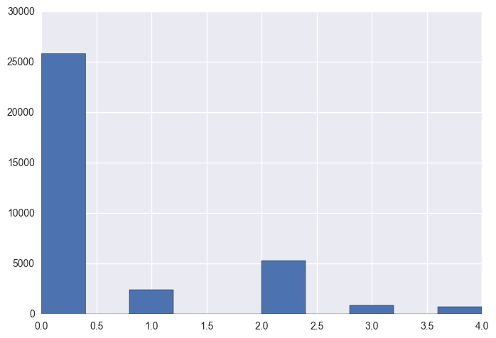
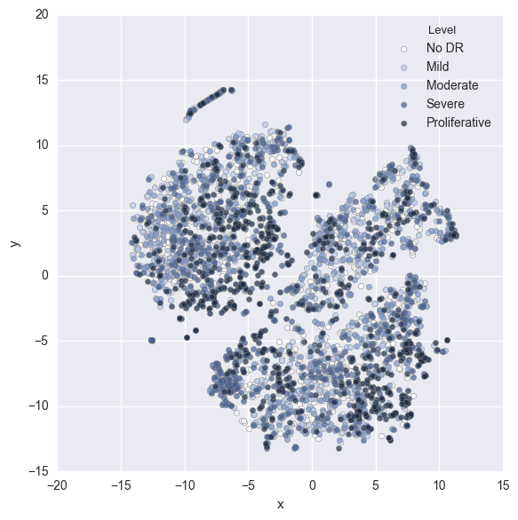
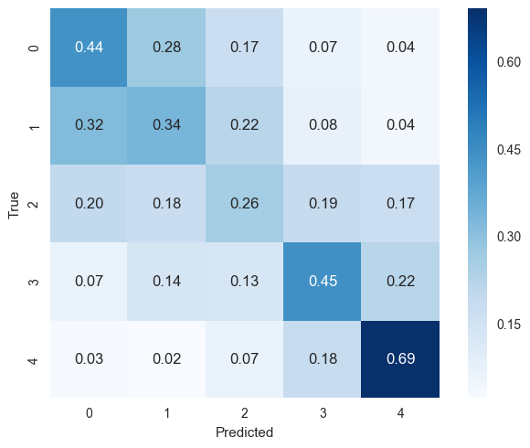

```python
%pylab inline
```

    Populating the interactive namespace from numpy and matplotlib


```python
import pandas as pd
import seaborn as sns
from sklearn.metrics import confusion_matrix
from sklearn import manifold
from sklearn import model_selection, linear_model
```

# Load features and labels

`features.npy` contains a NumPy array of shape (number of images, number of features) = (35126, 2048)

`keys.npy` contains the corresponding image 'names' — the filenames without the .jpeg suffix. 

`trainLabels.csv` maps these names to the level of diabetic retinopathy (0 — No DR, 1 — Mild, 2 — Moderate', 3 — Severe, 4 — Proliferative).


```python
keys = np.load('keys.npy')
features = np.load('features.npy')
sharpness = np.load('sharpness.npy')
labels_df = pd.read_csv('trainLabels.csv', index_col='image')

# Check lengths are the same for all raw data
len(keys), len(features), len(sharpness), len(labels_df)
```


    (35126, 35126, 35126, 35126)


# Map image names to levels
Using an inner join.


```python
features_df = pd.DataFrame(features, index=keys)
features_df['sharpness'] = sharpness
df = pd.merge(features_df, labels_df, how='inner', left_index=True, right_index=True)
```


```python
df.head(4)
```


<div>
<table border="1" class="dataframe">
  <thead>
    <tr style="text-align: right;">
      <th></th>
      <th>0</th>
      <th>1</th>
      <th>2</th>
      <th>3</th>
      <th>4</th>
      <th>5</th>
      <th>6</th>
      <th>7</th>
      <th>8</th>
      <th>9</th>
      <th>...</th>
      <th>2040</th>
      <th>2041</th>
      <th>2042</th>
      <th>2043</th>
      <th>2044</th>
      <th>2045</th>
      <th>2046</th>
      <th>2047</th>
      <th>sharpness</th>
      <th>level</th>
    </tr>
  </thead>
  <tbody>
    <tr>
      <th>10_left</th>
      <td>0.526682</td>
      <td>0.043948</td>
      <td>0.042256</td>
      <td>0.029524</td>
      <td>0.425382</td>
      <td>0.424015</td>
      <td>0.007560</td>
      <td>0.458355</td>
      <td>0.099644</td>
      <td>0.203269</td>
      <td>...</td>
      <td>0.088355</td>
      <td>0.191702</td>
      <td>0.202443</td>
      <td>0.047101</td>
      <td>0.340382</td>
      <td>0.949681</td>
      <td>0.095512</td>
      <td>0.346594</td>
      <td>11.919417</td>
      <td>0</td>
    </tr>
    <tr>
      <th>10_right</th>
      <td>0.316538</td>
      <td>0.064303</td>
      <td>0.111772</td>
      <td>0.015365</td>
      <td>0.415922</td>
      <td>0.678155</td>
      <td>0.001650</td>
      <td>1.000529</td>
      <td>0.061218</td>
      <td>0.207925</td>
      <td>...</td>
      <td>0.225751</td>
      <td>0.339383</td>
      <td>0.337852</td>
      <td>0.251831</td>
      <td>0.491701</td>
      <td>0.638236</td>
      <td>0.065918</td>
      <td>0.579277</td>
      <td>9.066678</td>
      <td>0</td>
    </tr>
    <tr>
      <th>13_left</th>
      <td>0.404190</td>
      <td>0.400065</td>
      <td>0.017244</td>
      <td>0.058396</td>
      <td>0.542456</td>
      <td>0.463827</td>
      <td>0.244821</td>
      <td>0.653481</td>
      <td>0.175902</td>
      <td>0.143579</td>
      <td>...</td>
      <td>0.257084</td>
      <td>0.171873</td>
      <td>0.019319</td>
      <td>0.004694</td>
      <td>0.102028</td>
      <td>0.737695</td>
      <td>0.232218</td>
      <td>0.641074</td>
      <td>14.193949</td>
      <td>0</td>
    </tr>
    <tr>
      <th>13_right</th>
      <td>0.520057</td>
      <td>0.271358</td>
      <td>0.013167</td>
      <td>0.005301</td>
      <td>0.710363</td>
      <td>0.430825</td>
      <td>0.019369</td>
      <td>0.618148</td>
      <td>0.147279</td>
      <td>0.079770</td>
      <td>...</td>
      <td>0.370906</td>
      <td>0.084486</td>
      <td>0.042817</td>
      <td>0.014832</td>
      <td>0.045585</td>
      <td>0.765283</td>
      <td>0.125689</td>
      <td>0.619225</td>
      <td>12.487727</td>
      <td>0</td>
    </tr>
  </tbody>
</table>
<p>4 rows × 2050 columns</p>
</div>


# Distribution of DR levels
There are many more images with no diabetic retinopathy (level = 0) than those with.


```python
df.level.hist();
```





# Balance classes

First, recover features and labels as numpy arrays X and y suitable for `sklearn`.


```python
feature_cols = df.columns[:-2] # only Inception v3 features
feature_cols = df.columns[:-1] # Inception v3 features + sharpness
X = df[feature_cols].values
y = df['level'].values
#s = df['sharpness'].values

X.shape, y.shape#, s.shape
```


    ((35126, 2049), (35126,))


Randomly sample to get equal samples in each of the five classes.


```python
np.random.seed(42)
min_class = pd.Series(y).value_counts().min() # number of samples in smallest class
#min_class = 100 # reduced dataset size for speed
# all_idx[y==label] selects all elements in X & y where y == label
# np.random.choice chooses a random subset of these of size min_class
all_idx = np.arange(len(X))
bal_idx = np.ravel([np.random.choice(all_idx[y==label], size=min_class, replace=False) 
                    for label in set(y)])

# Balanced X and y
X_bal = X[bal_idx]
y_bal = y[bal_idx]
#s_bal = s[bal_idx]

# Check equal numbers of each level
pd.Series(y_bal).value_counts()
```


    3    708
    1    708
    4    708
    2    708
    0    708
    dtype: int64


# Visualize with t-SNE

I find t-SNE an excellent way to check if high-dimensional features separate into easily identifiable classes.


```python
tsne = manifold.TSNE(n_components=2, init='random', perplexity=30, 
                     early_exaggeration=8, random_state=42, verbose=2)
X_tsne = tsne.fit_transform(X_bal)
```

    [t-SNE] Computing pairwise distances...
    [t-SNE] Computing 91 nearest neighbors...
    [t-SNE] Computed conditional probabilities for sample 1000 / 3540
    [t-SNE] Computed conditional probabilities for sample 2000 / 3540
    [t-SNE] Computed conditional probabilities for sample 3000 / 3540
    [t-SNE] Computed conditional probabilities for sample 3540 / 3540
    [t-SNE] Mean sigma: 2.796067
    [t-SNE] Iteration 25: error = 1.9307557, gradient norm = 0.0085648
    [t-SNE] Iteration 50: error = 1.8253492, gradient norm = 0.0054434
    [t-SNE] Iteration 75: error = 1.5590200, gradient norm = 0.0018105
    [t-SNE] Iteration 100: error = 1.5128213, gradient norm = 0.0015361
    [t-SNE] KL divergence after 100 iterations with early exaggeration: 1.512821
    [t-SNE] Iteration 125: error = 1.4373329, gradient norm = 0.0011963
    [t-SNE] Iteration 150: error = 1.4136711, gradient norm = 0.0010951
    [t-SNE] Iteration 175: error = 1.4078240, gradient norm = 0.0010716
    [t-SNE] Iteration 200: error = 1.4062644, gradient norm = 0.0010652
    [t-SNE] Iteration 225: error = 1.4058255, gradient norm = 0.0010634
    [t-SNE] Iteration 250: error = 1.4057109, gradient norm = 0.0010628
    [t-SNE] Iteration 275: error = 1.4056796, gradient norm = 0.0010627
    [t-SNE] Iteration 300: error = 1.4056692, gradient norm = 0.0010627
    [t-SNE] Iteration 300: error difference 0.000000. Finished.
    [t-SNE] Error after 300 iterations: 1.512821


## Create DataFrame for plotting


```python
legend_map = {0:'No DR', 1:'Mild', 2:'Moderate', 3:'Severe', 4:'Proliferative'}
f = np.vectorize(lambda x: legend_map[x])
df_tsne = pd.DataFrame({'x': X_tsne[:,0], 'y': X_tsne[:,1], 'Level': f(y_bal)})
```

## Plot
There are some clearly defined groups in the plot but unfortunately not great separation between the levels of diabetic retinopathy. On further investigation the well-separated groups correspond to different croppings of the original images and whether the image is inverted (some retina camera do this). 

The plot suggests that classifcation models will struggle to perform very well.


```python
pal = sns.cubehelix_palette(n_colors=5, light=1.0, rot=0.0, start=2.8, hue=1.0)
sns.lmplot(data=df_tsne, x='x', y='y', hue='Level', 
           size=6, fit_reg=False, palette=pal, legend_out=False,
           scatter_kws={'s':20, 'edgecolors':'gray', 'linewidths':0.5, 'alpha':0.7});
```





# Holdout set
on the balanced data


```python
X_train, X_test, y_train, y_test = model_selection.train_test_split(X_bal, y_bal, test_size=0.3,
                                                                    stratify=y_bal, random_state=42)
X_train.shape, y_train.shape, X_test.shape, y_test.shape
```


    ((2478, 2049), (2478,), (1062, 2049), (1062,))


# Logistic regression
Fit a simple logisitic regression model on the balanced data.


```python
reg = linear_model.LogisticRegression(C=0.1) # 0.44
reg.fit(X_train, y_train)

y_pred = reg.predict(X_test)
reg.score(X_test, y_test)
```


    0.435969868173258


# Confusion matrix
Raw values


```python
labels = [0,1,2,3,4]
cm = confusion_matrix(y_test, y_pred, labels=labels)
print(cm)
```

    [[ 94  59  37  14   9]
     [ 68  72  47  16   9]
     [ 42  38  55  40  37]
     [ 14  29  28  95  47]
     [  7   5  14  39 147]]


Normalised to row sums


```python
cm_norm = cm.astype('float') / cm.sum(axis=1)[:, np.newaxis]
sns.heatmap(cm_norm, square=True, annot=True, fmt='0.2f',
            annot_kws={'fontsize':12}, cmap='Blues', 
            xticklabels=labels, yticklabels=labels);
plt.ylabel('True');
plt.xlabel('Predicted');
```





So the model manages to predict 69 % of proliferative DR correctly and only wrongly classifies 3 % of profliferative DR as no DR.
